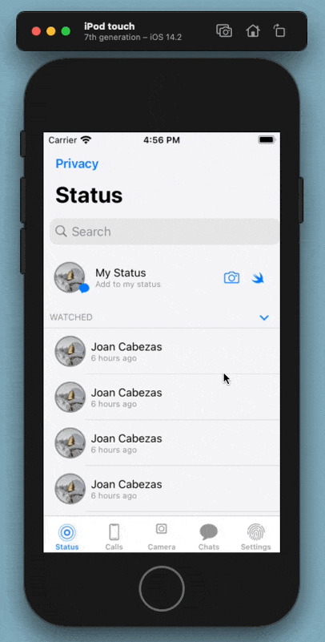
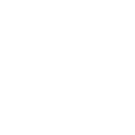

## SwiftUI Whatsapp "clone"

This project aims to create an UI clone of Whatsapp using Swift UI.

- ```SearchBar``` implementation extending an ```UIKit``` class
- ```CameraPicker``` implementation extending an ```UIKit``` class
- ```NavigationController``` component
- ```Lists```  ```VStacks``` and  ```Sections``` proper hierarchy management.




Kudos to @KarenPabon for the bottom tab items icons and the appIcon.
-> Unfortunately I was unable to set custom images properly for tab Items, if you have any ideas PR's are welcome 😄

  
 
 
